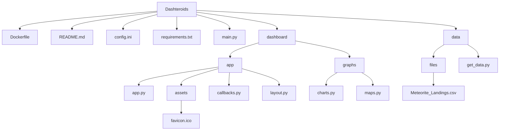

# Dashteroids ☄️
Welcome to Dashteroids, your comprehensive dashboard for visualizing and analyzing meteorite landing data. This tool is designed to provide insightful analytics through interactive charts and maps. It can be used with our without internet connection.

## User Guide 📖
### Prerequisites

Before you begin, make sure you have the following prerequisites installed:

- **Python**: Version 3.9 or higher. Python is the backbone of our dashboard, and you'll need it to run the application directly.
- **Pip**: The Python package installer, which you will use to install the dependencies required by Dashteroids.
or
- **Docker**: An optional but recommended way to deploy the application, ensuring consistency across different environments.

### Tech Stack
Dashteroids is built using a few powerful technologies :
- **Python**: For server-side logic and running the Dash app.
- **Dash**: A Python framework for building analytical web applications, making it easy to create interactive, web-based data visualizations.
- **Docker**: For creating a containerized version of the application, which simplifies deployment and scaling.

### How to use
#### Install
1. **Clone the Repository**: Get a copy of the source code on your local machine.
``` bash
git clone https://github.com/WhiteWall13/Dashteroids
```
#### Using python
**Option 1**: Running with Python
If you prefer to run the application directly using Python, follow these steps :
1. **Install Dependencies**: Use pip to install the required Python packages.
``` bash
pip install -r requirements.txt
```

2. **Start the Development Server**: Launch the application using Python.
``` bash
python main.py
```
3. **Access the Dashboard**: Open your preferred web browser and visit `http://localhost:8050` to start exploring the data.


#### Using Docker
**Option 2**: Running with Docker
For those who prefer Docker for its ease of use and deployment, here's how to get started:


1. **Build the Docker Image**: This will create a Docker image with all the necessary dependencies pre-installed.
``` bash
docker build -t dashteroids .
```
2. **Run the Docker Container**: Start a container from the image. This command also maps the container's port to your local port.
``` bash
docker run -p 8050:8050 dashteroids
```
3. **View the Dashboard**: Just like with the Python option, open your browser and go to `http://localhost:8050`.

## Developper guide 🧑‍💻

After successfully launching the Dashteroids dashboard, you may be curious about the underlying code and architecture. This section provides a detailed walkthrough of the codebase, making it easier for developers to navigate and understand the project.

### Understanding the Entry Point

- `main.py`: This script is where the Dash server is initialized and run. It sets up the server, registers the app's layout and callbacks, and starts the server loop. When you execute `python main.py`, this script kicks off the entire application.

### Dashboard Directory Structure

The `dashboard/` directory is the heart of the application, containing all the Dash-related components.

#### App Module

- `App/`: This subdirectory is crucial as it contains the core components of the Dash application.
  - `app.py`: Defines the Dash app instance and server. It's where you configure global settings for the Dash app, such as the title, external stylesheets, and server settings.
  - `layout.py`: Contains the HTML and Dash components that define the structure and appearance of the web application. It's essentially the blueprint of your dashboard's user interface.
  - `callbacks.py`: Houses the callback functions that make the dashboard interactive. Callbacks in Dash link the interactive components (like buttons and dropdowns) with the backend logic that updates the app's data and visuals.

#### Graphs Module

- `graphs/`: This directory includes the Python modules that create the visualizations.
  - `charts.py`: Contains functions that define the structure and style of the charts used in the dashboard. These functions are called by the callbacks to update the charts based on user interaction.
  - `maps.py`: Similar to `charts.py`, but focused on generating geospatial visualizations. It uses data processing and mapping libraries to turn raw data into interactive maps.

### Data Handling

- `data/`: This directory is where the datasets and data processing scripts reside.
  - `get_data.py`: This file contains functions that handle data retrieval, cleaning, and preprocessing. They transform raw data into a format that can be used by the dashboard's visual components.
  - `file/Meteorite_Landings.csv`: Depending on the project setup, this could include CSV file, JSON data, or links to databases that the application queries to retrieve its data.
- `file/Meteorite_Landings.csv`: This CSV file serves as an offline dataset for the dashboard. This data is used to populate the dashboard with information and visualizations when there is no active internet connection or when live data fetching is not required.


## Author ✍️
#### Nicolas Hameau  



